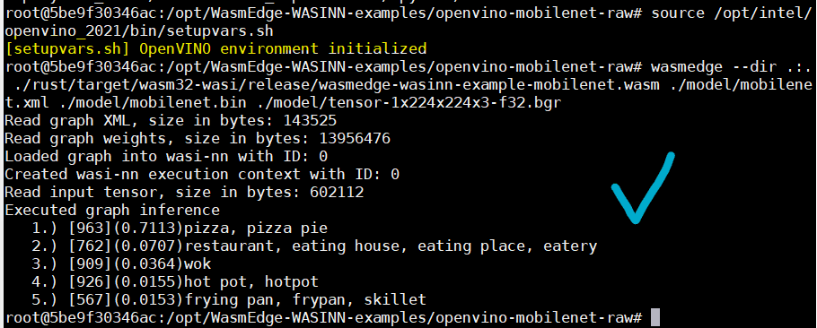
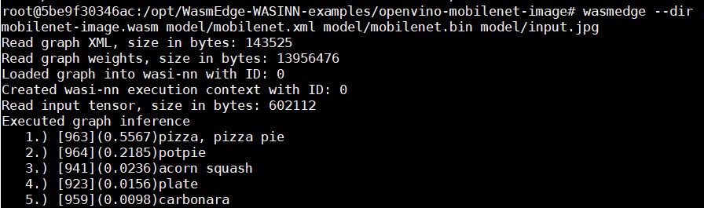

# Mobilenet example for WASI-NN

This is a running record of the official example.

[wasi-nn]: https://github.com/WebAssembly/wasi-nn


## Runtime environment
```
Linux 5be9f30346ac 5.4.0-47-generic #51-Ubuntu SMP Fri Sep 4 19:50:52 UTC 2020 x86_64 x86_64 x86_64 GNU/Linux
```

## Preparatory work

[This guide](https://wasmedge.org/book/en/dev/rust/wasinn.html) for setting up the working environment, however, there are some commands and environment Settings that require additional attention.

- When running the container here I recommend mapping '*/opt* ' directory to the container '*/opt* ' directory, like *-v /opt:/opt*, so that cmake can find **InferenceEngineConfig.cmake** and **inferenceengine-config.cmake**.
  
- Add option **-DInferenceEngine_DIR=\
  <PATH/TO/YOUT/OPENVINO/deployment_tools/inference_engine/share/** 
   when you code *cmake -DCMAKE_BUILD_TYPE=Release -DWASMEDGE_PLUGIN_WASI_NN_BACKEND="OpenVINO" .. && make -j*


## Build

Compile the application to WebAssembly:

```bash
cargo build --target=wasm32-wasi --release
```

The output WASM file will be at `target/wasm32-wasi/release/wasmedge-wasinn-example-mobilenet-image.wasm`.
To speed up the image processing, we can enable the AOT mode in WasmEdge with:

```bash
wasmedgec rust/target/wasm32-wasi/release/wasmedge-wasinn-example-mobilenet-image.wasm wasmedge-wasinn-example-mobilenet-image.wasm
```

## Run

First download the fixture files with the script:

```bash
./download_mobilenet.sh
```

it will also download a testing image `input.jpg`


And execute the WASM with the `wasmedge` with OpenVINO supporting:

```bash
wasmedge --dir .:. rust/target/wasm32-wasi/release/wasmedge-wasinn-example-mobilenet-image.wasm model/mobilenet.xml model/mobilenet.bin model/input.jpg
```

You will get the output:

### openvino-mobilenet-raw



<br>

### openvino-mobilenet-image


